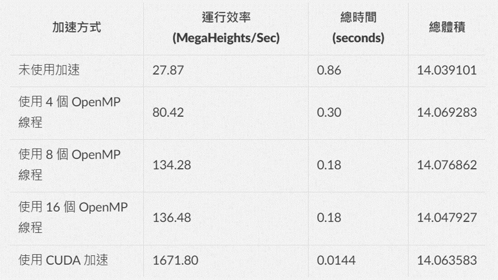

# ParallelBezSurf

ParallelBezSurf is a project that utilizes OpenMP and CUDA to accelerate Bezier surface computations.

## Introduction

Bezier surfaces are widely used in computer graphics and modeling. However, the computations involved in evaluating Bezier surfaces can be computationally intensive, especially for large surfaces. This project aims to leverage the power of parallel computing to accelerate the computation of Bezier surfaces using OpenMP and CUDA.

## Features

- Utilizes OpenMP to parallelize the computation of Bezier surfaces on multi-core CPUs.
- Utilizes CUDA to offload the computation of Bezier surfaces to the GPU for even greater acceleration.
- Provides a user-friendly interface for specifying the control points and evaluating the Bezier surfaces.
- Supports both 2D and 3D Bezier surfaces.

## Getting Started

### Prerequisites

- GCC compiler with OpenMP support
- CUDA-enabled GPU (for CUDA acceleration)

### Installation

1. Clone the repository:

    ```shell
    git clone https://github.com/ntnuYuhsuan/ParallelBezSurf.git
    ```

2. Build the project:

    ```bash
    sudo apt-get update
    sudo apt-get install build-essential
    ```

### Usage

1. Modify the control points in the source code to define your desired Bezier surface.

    ```
    #define THREADS
    #define NUMS
    dim3 blockSize(1024);
    ```

2. Compile and run the program:

    ```shell
    ./exe.sh
    ```

### Result



## Contributing

NTNU 方語軒 612K0028C@ntnu.edu.tw

## Acknowledgements

- [OpenMP](https://www.openmp.org/)
- [CUDA](https://developer.nvidia.com/cuda-zone)
- [Best thanks Anthony Openmp projects](https://github.com/t0nyt93/OpenMP-Projects/tree/master)
- [Bezier Volume Code](https://github.com/t0nyt93/OpenMP-Projects/blob/master/Bezier_Volume/main.cpp)
